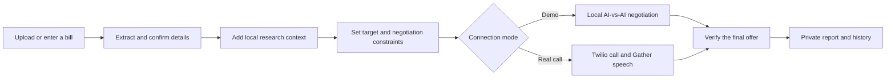
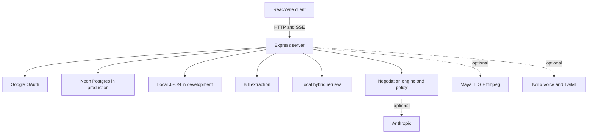

<p align="center">
  
</p>

<h1 align="center">Ringside</h1>

<p align="center">
  An AI-assisted bill negotiation agent with local bill intelligence, policy-bound negotiation, optional voice calls, and private savings history.
</p>

<p align="center">
  
  
  
</p>

## What is Ringside?

Recurring bills are often negotiable, but finding comparable plans, collecting account details, and staying firm through a support call takes time. Ringside turns that work into a structured negotiation workflow: extract bill details, set a target, attach local research, run a policy-bound negotiation, and retain the outcome for the signed-in user.

The repository contains a React/Vite application and one Express service. It supports a deterministic local demo, optional Anthropic-generated lines, optional Maya speech synthesis, and an optional Twilio human-call path. The demo does not place a phone call or require an LLM or TTS credential; Google sign-in is still required before a negotiation can start so records remain private.

Ringside is deliberately explicit about its current boundaries. Its research layer is a local metadata-aware keyword store, not embeddings or a vector database. Bill extraction is local text/OCR plus heuristics, not a cloud document model. Human calls use Twilio Gather speech capture, not a persistent media-stream runtime.

## How it works



## Product flow

| Route | Purpose |
| --- | --- |
| `/` | Landing page and product overview. |
| `/new` | Upload a bill or enter details, review the extraction, add a target, and select Demo or Real Call mode. |
| `/login` | Google-only sign-in that preserves the in-progress negotiation draft. |
| `/call/:id` | Live dashboard with scoped SSE events, transcript, offer movement, and call state. |
| `/negotiation/:id` | Durable report with verification, strategy, research sources, and transcript. |
| `/history` | Owner-scoped negotiation history and savings summary. |

## Features

### Bill intelligence

- Upload PDF, PNG, JPEG, TXT, Markdown, or JSON bills up to 8 MB.
- Read PDF text with local `pdftotext` when installed and images with local Tesseract when installed.
- Parse provider, plan, monthly price, selected charges, speed, and account/invoice identifiers.
- Mask account and invoice identifiers before returning extracted details to the browser.
- Fall back to manual confirmation when text cannot be read.

### Negotiation engine

- Track the current bill, target price, maximum acceptable price, turn budget, and negotiation levers.
- Use deterministic fallback lines for provider-independent demo mode.
- Optionally use Anthropic for generated lines while keeping the policy layer in control of the final spoken text.
- Filter instruction-like content in bill text, notes, and human speech before it reaches negotiation state.
- Verify a final offer before presenting it as a win and calculate monthly and annual savings.

### Research

- Ingest local text, Markdown, or JSON knowledge sources.
- Chunk documents and attach source, company, category, plan, country, and timestamp metadata.
- Retrieve with keyword overlap, recency weighting, and exact metadata filters.
- Include retrieved local sources in the negotiation research context and report.

### Voice and runtime

- Run an AI-vs-AI demo that emits the same lifecycle events used by the dashboard.
- Place optional Twilio calls to a human phone number.
- Collect human responses through Twilio `<Gather input="speech">`.
- Generate optional Maya TTS audio, resample it with ffmpeg to 8 kHz WAV, and use TwiML `<Say>` if audio is unavailable.
- Scope live dashboard events to the signed-in negotiation owner.

## Quick start

### Prerequisites

- Node.js 20 or later
- npm
- A Google OAuth web client for sign-in
- Optional: `pdftotext` for PDFs, Tesseract for image OCR, and ffmpeg for Maya-generated call audio

Install the root and frontend dependencies:

```bash
git clone https://github.com/AnuragTummapudi/Ringside.git
cd Ringside
npm install
(cd frontend && npm install)
cp .env.example .env
```

Configure Google OAuth in `.env` and add this redirect URI to the OAuth client for local development:

```text
http://localhost:3000/auth/google/callback
```

Build the frontend and start the Express service:

```bash
npm run build
npm run dev
```

Open [http://localhost:3000](http://localhost:3000). `npm run build` clears old Vite bundles and rebuilds `public/`; `npm run dev` serves that output and the API from port `3000`.

For frontend-only iteration, use a second terminal:

```bash
cd frontend
npm run dev
```

Vite runs on its default development port. Set `VITE_API_BASE` in the frontend environment when it must call an API hosted on a different origin.

## Demo mode

Demo mode is the recommended local path. After Google sign-in, create a negotiation from `/new`, choose **Demo mode**, and start it. The server runs a deterministic AI-vs-AI negotiation and streams call-state events to the dashboard. It does not create a Twilio call, use Anthropic, or require Maya TTS.

To add local research before starting a negotiation:

```bash
npm run rag:ingest -- sample-bills/airtel-demo.txt pricing Airtel
```

The sample bill is synthetic. It is safe to use for local exploration and demonstrates extraction plus local research retrieval.

## Real voice calls

Real Call mode is optional and should be configured separately from the local demo. It requires:

1. A Twilio account and a Voice-capable Ringside number.
2. `TWILIO_ACCOUNT_SID`, `TWILIO_AUTH_TOKEN`, and `TWILIO_RINGSIDE_NUMBER`.
3. A public HTTPS URL in `NGROK_URL`. During local development, run `ngrok http 3000`; in production, use the deployed backend URL.
4. Maya credentials and ffmpeg for generated audio, or accept the TwiML `<Say>` fallback.

The supplied phone number in Real Call mode is the number Ringside will call. On a Twilio trial account, the destination must be verified and the destination country's voice permissions must be enabled.

Before placing a call, the server checks `NGROK_URL/healthz`. In production, keep `REQUIRE_TWILIO_SIGNATURES=true` and do not enable `PUBLIC_OUTBOUND_CALLS_ENABLED` until the deployment is ready for real outbound calls.

## Bill intelligence

The upload endpoint stores a temporary file in `data/uploads`, extracts up to 20,000 characters, and removes the temporary upload after processing. Directly readable text files use the local filesystem. PDF extraction uses `pdftotext`; image extraction uses Tesseract. If either executable is unavailable or no usable text is found, the API returns `needs_confirmation` and the UI keeps manual entry available.

The parser returns heuristic confidence values for selected fields. They are field-presence signals, not a calibrated document-understanding score. Review and edit extracted values before starting a negotiation.

## RAG and research

Ringside's current RAG implementation is intentionally lightweight:

```text
Local text file
  -> overlapping character chunks
  -> JSON storage with metadata
  -> keyword overlap + recency scoring
  -> metadata filtering
  -> negotiation research context
```

It does not use an embedding model, vector store, external web search, or automatic source crawler. This makes local behavior inspectable but also means research quality depends on the documents you ingest. See [docs/architecture.md](docs/architecture.md) for implementation details.

## Architecture



The server keeps active call state in memory. Completed records are persisted. A process restart therefore ends any active in-memory call session; production deployments should account for that operational constraint.

## Deployment

`railway.json` deploys the Express backend. It installs both package trees, builds the frontend from source, and then starts `node server.js`. Configure the production environment with `NODE_ENV=production`, Google OAuth, `AUTH_SESSION_SECRET`, `DATABASE_URL`, and the appropriate `ALLOWED_ORIGINS`. Production startup intentionally fails when Neon or Google OAuth is absent.

`vercel.json` is a frontend-only configuration. It builds `frontend/` into `public/` and rewrites browser routes to the React entry point. When Vercel hosts the frontend separately, set `VITE_API_BASE` to the backend's HTTPS URL and add the Vercel origin to the backend's `ALLOWED_ORIGINS`. Twilio webhooks must always target the backend, not the Vercel frontend.

## Configuration

Copy `.env.example` to `.env`. Keep all real values out of Git.

| Variable | Required | Purpose |
| --- | --- | --- |
| `NODE_ENV` | Yes | `development` locally; `production` enforces Neon and Google OAuth at startup. |
| `PORT` | Yes | Express listen port; defaults to `3000`. |
| `APP_URL` | Recommended | Base URL used to derive the OAuth callback when `GOOGLE_REDIRECT_URI` is absent. |
| `ALLOWED_ORIGINS` | When split frontend/API | Comma-separated browser origins allowed by CORS. |
| `GOOGLE_CLIENT_ID` | Yes for sign-in | Google OAuth web client ID. |
| `GOOGLE_CLIENT_SECRET` | Yes for sign-in | Google OAuth client secret; server-side only. |
| `GOOGLE_REDIRECT_URI` | Yes for sign-in | Exact OAuth callback URL. |
| `AUTH_SESSION_SECRET` | Yes | HMAC secret for OAuth state. Required in production. |
| `AUTH_COOKIE_SAME_SITE` | No | Cookie policy: `lax`, `strict`, or `none`. |
| `AUTH_COOKIE_SECURE` | No | Force secure cookies outside production when needed. |
| `DATABASE_URL` | Required in production | Neon PostgreSQL connection string. Local development uses JSON when absent. |
| `ANTHROPIC_API_KEY` | No | Enables Anthropic-generated negotiation lines outside demo transport. |
| `MAYA_API_KEY` | No | Enables Maya speech synthesis. |
| `RINGSIDE_VOICE_ID` | With Maya | Maya voice ID for Ringside. |
| `REP_VOICE_ID` | With Maya | Maya voice ID for the demo representative. |
| `TWILIO_ACCOUNT_SID` | Real calls | Twilio account identifier. |
| `TWILIO_AUTH_TOKEN` | Real calls | Twilio webhook validation and API credential. |
| `TWILIO_RINGSIDE_NUMBER` | Real calls | Voice-capable Twilio number in E.164 format. |
| `TWILIO_REP_NUMBER` | Optional agent call path | Default destination for the Twilio agent-call path. |
| `NGROK_URL` | Real calls | Public HTTPS base URL used for TwiML, audio, and status callbacks. |
| `RINGSIDE_API_TOKEN` | Internal API access | Enables access to the internal `/api/negotiate` endpoint and production call gating. |
| `PUBLIC_OUTBOUND_CALLS_ENABLED` | Production only | Explicitly permits public outbound call starts. Defaults to `false`. |
| `REQUIRE_TWILIO_SIGNATURES` | Production | Forces Twilio request signature validation outside production. |
| `TTS_CONCURRENCY` | No | Maximum parallel TTS generation tasks. |
| `TTS_TIMEOUT_MS` | No | Maya request timeout in milliseconds. |
| `AUDIO_RETENTION_MS` | No | Per-call generated-audio cleanup delay in milliseconds. |

`NEON_DATABASE_URL` is also recognized as a fallback connection-string name. `MAYA_LIST_VOICES=true` only enables optional voice discovery inside the TTS smoke test.

## API

All JSON endpoints are served by the Express process. Owner-scoped endpoints require the Google session cookie; Twilio endpoints are internal webhook endpoints.

| Method | Endpoint | Access | Purpose |
| --- | --- | --- | --- |
| `GET` | `/healthz` | Public | Deployment and webhook reachability check. |
| `GET` | `/api/auth/config` | Public | Returns sign-in and persistence configuration status. |
| `GET` | `/api/auth/me` | Public | Returns the current user or `null`. |
| `GET` | `/auth/google` | Public | Begins Google OAuth. |
| `GET` | `/auth/google/callback` | Google callback | Completes OAuth and creates a session. |
| `POST` | `/api/auth/logout` | Session | Ends the current session. |
| `POST` | `/api/bills/upload` | Public processing | Accepts one supported bill file and returns masked extraction data. |
| `POST` | `/api/bills/extract` | Public processing | Parses manually supplied bill text. |
| `POST` | `/api/rag/search` | Public | Searches locally ingested knowledge. |
| `POST` | `/api/research` | Public | Builds local research context from supplied negotiation data. |
| `POST` | `/api/call/start` | Session | Starts demo, agent, or human call execution. |
| `POST` | `/api/negotiations` | Session | Compatibility route that starts a demo negotiation. |
| `GET` | `/api/events?callId=...` | Session | Scoped SSE stream for an active call. |
| `GET` | `/api/state/:callId` | Session | Active or persisted call state. |
| `GET` | `/api/calls` | Session | Owner-scoped history. |
| `GET` | `/api/negotiations/:callId` | Session | Durable negotiation record. |
| `POST` | `/api/verify-offer` | Session | Applies final-offer verification rules. |
| `POST` | `/api/call/:callId/pause` | Session | Marks an active call paused. |
| `POST` | `/api/call/:callId/resume` | Session | Marks an active call live. |
| `POST` | `/api/call/:callId/end` | Session | Finalizes an active call. |
| `POST` | `/api/negotiate` | Internal token | Runs a text negotiation without the browser flow. |
| `POST` | `/twiml/*` | Twilio webhook | TwiML and speech-gather call handlers. |
| `POST` | `/api/call-status` | Twilio webhook | Receives Twilio call status callbacks. |

## Project structure

```text
Ringside/
├── frontend/                  # React/Vite application and source assets
│   └── src/
│       ├── components/        # Landing and shared UI
│       └── pages/             # Product routes
├── public/                    # Built frontend served by Express
├── sample-bills/              # Synthetic local demo fixtures
├── docs/
│   ├── architecture.md        # Runtime boundaries and providers
│   └── troubleshooting.md     # OAuth, Twilio, OCR, and deployment help
├── auth.js                    # Google OAuth and session handling
├── bill.js                    # Local extraction and client-side masking
├── negotiate.js               # Negotiation state machine
├── policy.js                  # Input/output safety policy
├── rag.js                     # Local chunking and retrieval
├── persistence.js             # Neon/local persistence adapter
├── report.js                  # Offer verification and reports
├── server.js                  # API, SSE, demo runtime, and Twilio webhooks
├── storage.js                 # Local JSON development store
└── tts.js                     # Maya synthesis and ffmpeg conversion
```

## Development

```bash
# Build the production frontend output
npm run build

# Type-check the frontend without producing a new app bundle
npm run typecheck

# Start the API and built frontend on port 3000
npm run dev

# Prepare the production Neon schema
npm run db:migrate

# Ingest a local research document
npm run rag:ingest -- path/to/document.txt category CompanyName
```

There is no lint script configured in this repository. The frontend build runs TypeScript project checking before Vite bundles the client.

## Testing

```bash
# Deterministic guardrails and negotiation-engine tests
npm test

# Static deployment, auth, persistence, and safety checks
npm run preflight

# Optional external Maya synthesis smoke test
npm run test:tts
```

`npm test` covers the policy firewall and deterministic negotiation behavior. `npm run preflight` verifies important static wiring, including production defaults, owner scoping, Twilio signature middleware, and audio access controls. There is currently no browser end-to-end test suite or measured coverage report.

## Troubleshooting

See [docs/troubleshooting.md](docs/troubleshooting.md) for OAuth redirect mismatch, Twilio webhook failures, local OCR prerequisites, TTS audio, and production-startup guidance.

## Security

- Keep `.env` and `.env.*` out of Git; only `.env.example` is tracked.
- OAuth tokens, provider credentials, Twilio credentials, and database URLs remain server-side.
- Sessions are opaque `HttpOnly` cookies and are persisted as hashes.
- Negotiations, SSE events, state, reports, and history are owner-scoped.
- Production startup rejects missing Neon or Google OAuth configuration, and production outbound calls default to closed.
- Review [SECURITY.md](SECURITY.md) before reporting a vulnerability.

## Privacy

Bills, extracted billing details, phone numbers, call transcripts, and negotiation history can contain sensitive personal information. Temporary uploads are removed after processing. Signed-in bill records and negotiation records are persisted to Neon in production or local JSON during development. Generated per-call audio is scheduled for cleanup using `AUDIO_RETENTION_MS`; fallback cache audio is managed separately.

This repository does not currently expose a self-service deletion workflow, a data-retention dashboard, or a legal/privacy policy. Do not upload real customer data to a deployment unless its storage, retention, consent, and deletion obligations have been reviewed for the intended jurisdiction.

## Contributing

1. Fork the repository and create a focused branch.
2. Keep provider keys and customer data out of commits.
3. Run `npm run build`, `npm test`, and `npm run preflight` before opening a pull request.
4. Update the README or relevant document when behavior, setup, or security boundaries change.

## License

This repository does not currently include a license file. Do not assume permission to redistribute or reuse it until the maintainer selects and adds a license.
