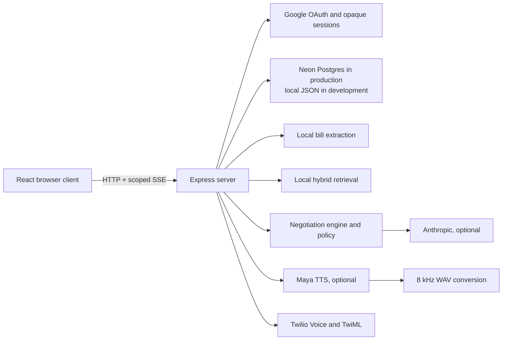

# Architecture

Ringside is a single Node.js service that serves the React application and owns the API surface. It avoids a separate queue, websocket broker, vector database, or streaming-media service in the current implementation.

## Browser and API

The React client is built by Vite into `public/`; Express serves that directory and falls back to `public/index.html` for client-side routes. `frontend/src/api.ts` provides an optional `VITE_API_BASE`, enabling a separately deployed frontend to call the backend.

The live dashboard uses an authenticated Server-Sent Events endpoint. Events are scoped to the requesting user and the active call ID; the server does not expose a shared broadcast stream.

## Identity and persistence

Google is the only end-user sign-in flow. OAuth state is HMAC-protected, session cookies are `HttpOnly`, and session values are persisted as SHA-256 hashes. In production, startup requires `DATABASE_URL` and Google OAuth configuration. Neon stores users, sessions, negotiation records, and bill records. Development can use `data/ringside.json` instead.

## Bill intelligence

Uploads are limited to 8 MB. Text, Markdown, and JSON are read directly. PDFs are read with the local `pdftotext` binary when installed; PNG/JPEG files use the local Tesseract binary when installed. The parser then applies field-specific heuristics for provider, plan, monthly price, account and invoice identifiers, and selected billing details. Account and invoice identifiers are masked before returning a bill to the browser.

There is no cloud OCR provider, model-based document extraction, or confidence calibration service in the current code.

## Research retrieval

`rag.js` chunks local text into overlapping character windows and stores it in the local JSON store with metadata. Queries use keyword overlap plus a small recency component and support exact metadata filters. Retrieved snippets are attached to the research context used by reports and the negotiation input.

This is intentionally a local hybrid keyword store. It does not create embeddings, use a vector index, call a web search provider, or provide a source-crawling pipeline.

## Negotiation and voice

The negotiation engine keeps structured state for the current offer, target, maximum price, turn budget, levers, and conversation history. `policy.js` filters untrusted text, sanitizes spoken output, and prevents accepting offers beyond the configured ceiling. Anthropic can improve generated lines, but deterministic fallback lines keep local demo mode provider-independent.

Demo mode emits the same call lifecycle events as a call but runs a local AI-vs-AI text negotiation. Human mode uses Twilio outbound calling, TwiML `<Gather input="speech">`, and Twilio's returned `SpeechResult`. It is request/response speech capture, not a persistent media-stream or websocket voice runtime. Maya synthesis is converted from raw PCM to 8 kHz WAV with ffmpeg; if synthesis is unavailable, TwiML falls back to `<Say>`.
